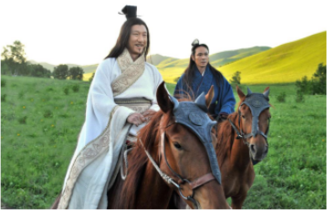
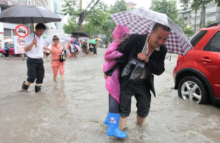

## 中文多模态预训练 Mengzi-Oscar 模型
Mengzi-Oscar 以英文多模态预训练模型[Oscar](https://github.com/microsoft/Oscar)为基础训练，使用 [Mengzi-Bert-base](https://huggingface.co/Langboat/mengzi-bert-base) 初始化，使用了3.7M图文对，其中包含0.7M中文 Image-Caption pairs，3M中文 Image-Question pairs，共0.22M张图像。
## 中文多模态预训练 Mengzi-Oscar 模型 - 下载
**预训练模型下载：**  [下载地址](https://huggingface.co/Langboat/mengzi-oscar-base)。  
**下游任务模型下载：**  [中文图像摘要](https://huggingface.co/Langboat/mengzi-oscar-base-caption).  [中文图文互检](https://huggingface.co/Langboat/mengzi-oscar-base-retrieval).
## 中文图像摘要 Demo（Randomly select from the AIC-ICC val set）
  
**Generated Caption：绿油油的草地上有两个面带微笑的人在骑马。**     

<br>

  
**Generated Caption：两个打着伞的人和一个背着孩子的男人走在被水淹没的道路上。**

## 模型使用（Pre-training / Image Caption / Retrieval）
### 安装 -- 通过 github 安装 [Oscar](https://github.com/microsoft/Oscar)
参考 [Oscar INSTALL.md](https://github.com/microsoft/Oscar/blob/master/INSTALL.md)

### 预训练 Pre-training
#### 1）预训练数据准备
Mengzi-Oscar使用了3.7M中文图文对，数据源分布：
| Source | VQA<br>(train) | GQA<br>(bal-train) | VG-QA<br>(train)	| COCO<br>(train) | Flicker30k<br>(train)|
| :-----: | :-----: | :-----: | :-----: | :-----: | :-----: |
| Image/Text | 83k/545k | 79k/1026k | 87k/931k | 112k/559k | 29k/145k |

图像目标检测，特征抽取：
我们使用了开源项目 X152-C4 object-attribute detection 作为目标检测工具，项目地址[Scene Graph Benchmark Repo](https://github.com/microsoft/scene_graph_benchmark).  
预训练 X152-C4 模型[下载地址](https://penzhanwu2.blob.core.windows.net/sgg/sgg_benchmark/vinvl_model_zoo/vinvl_vg_x152c4.pth)。 
通过以下命令抽取特征：
```
# pretrained models at https://penzhanwu2.blob.core.windows.net/sgg/sgg_benchmark/vinvl_model_zoo/vinvl_vg_x152c4.pth
# the associated labelmap at https://penzhanwu2.blob.core.windows.net/sgg/sgg_benchmark/vinvl_model_zoo/VG-SGG-dicts-vgoi6-clipped.json
python tools/test_sg_net.py --config-file sgg_configs/vgattr/vinvl_x152c4.yaml TEST.IMS_PER_BATCH 2 \
MODEL.WEIGHT <path of vinvl_vg_x152c4.pth> \
MODEL.ROI_HEADS.NMS_FILTER 1 MODEL.ROI_HEADS.SCORE_THRESH 0.2 \
DATA_DIR <path of image feature> \
OUTPUT_DIR <path to save extracted features> \
TEST.IGNORE_BOX_REGRESSION True MODEL.ATTRIBUTE_ON True TEST.OUTPUT_FEATURE True
```
对于目标检测的英文标签结果，我们提供了 [en-to-zh词表](https://github.com/ckmstydy/Mengzi/blob/main/chinese_label.json)，可自行将英文标签转换为中文标签。预训练数据格式、下游任务数据格式、英文原版数据在开源项目 [Oscar VinVL_DOWNLOAD.md](https://github.com/microsoft/Oscar/blob/master/VinVL_DOWNLOAD.md)中可见。

#### 2）运行预训练命令（基于 Mengzi bert base）
```
python -m torch.distributed.launch --nproc_per_node=8 oscar/run_oscarplus_pretrain.py \
--use_b 1 --max_grad_norm 10.0 \
--gradient_accumulation_steps 1 --use_img_layernorm 1 \
--output_dir <output floder to save the pretrained model> \
--bert_model bert --do_lower_case \
--model_name_or_path <path of mengzi bert base model> \
--learning_rate 1e-04 --warmup_steps 0 --do_train --max_seq_length 35 \
--on_memory --max_img_seq_length 50 --img_feature_dim 2054 --drop_out 0.1 \
--train_batch_size 1024 --ckpt_period 10000 --max_iters 2000000 --log_period 1000 \
--data_dir <path of pretraining data> \
--dataset_file coco_flickr30k_gqa.yaml \
--textb_sample_mode 1 --texta_false_prob 0.25 --num_workers 8 
```
### 中文图像摘要（fine-tune on COCO&AIC-ICC）
#### 1）fine-tune 数据准备
见 pretraining data 的目标检测、特征抽取方法。
#### 2）fine-tune
在 COCO image caption 数据集上进行微调（8 RTX 3090 24G）
```
python -m torch.distributed.launch --nproc_per_node=8 oscar/run_captioning.py \
--data_dir < path of downloaded coco dataset > \
--model_name_or_path <pat of pretrained Mengzi-Oscar model> \
--do_train --do_lower_case --add_od_labels --learning_rate 3e-5 \
--per_gpu_train_batch_size 128 --num_train_epochs 60 --tie_weights --freeze_embedding \
--label_smoothing 0.1 --drop_worst_ratio 0.2 --drop_worst_after 20000 \
--output_dir <path to save the fine-tune model> --num_workers 8
```
  
在 AIC-ICC train set 进行微调，并在 validation set 进行推理（8 RTX 3090 24G）  
```
python -m torch.distributed.launch --nproc_per_node=8 oscar/run_captioning.py \
--data_dir < path of AIC-ICC dataset > \
--model_name_or_path <path of pretrained model or finetuned coco caption model> \
--do_train --do_lower_case --add_od_labels --learning_rate 3e-5 \
--per_gpu_train_batch_size 128 --num_train_epochs 60 --tie_weights --freeze_embedding \
--label_smoothing 0.1 --drop_worst_ratio 0.2 --drop_worst_after 20000 \
--output_dir <path to save the finetuned model> --save_steps 1000 --logging_steps 1000 \
--evaluate_during_training --num_workers 8 --num_beams 5
```

在数据集上进行 inference
```
python -m torch.distributed.launch --nproc_per_node=8 oscar/run_captioning.py \
--data_dir <path of test dataset> \
--do_test --test_yaml test_ch.yaml \
--num_beams 5 --per_gpu_eval_batch_size 128 --max_gen_length 20 \
--eval_model_dir <path of fine-tuned Chinese Image Caption model>
```

### 中文图文互检（fine-tune on COCO and inference on AIC-ICC）
我们在 COCO_ir 数据集上进行微调，并从AIC-ICC validation set中选取1K张图片（每张图片包含5条ground truth caption）进行评测。
#### 1）fine-tune 数据准备
见 pretraining data 的目标检测、特征抽取方法。
#### 2）fine-tune
在 COCO_ir 数据集上进行微调：
```
python oscar/run_retrieval.py --model_name_or_path <path of pretrained model>\
--data_dir <path of coco_ir> \
--img_feat_file <path of pretraining coco features.tsv>\
--do_train --do_lower_case --evaluate_during_training --num_captions_per_img_val 20 \
--eval_caption_index_file minival_caption_indexs_top20.pt --per_gpu_train_batch_size 32 \
--per_gpu_eval_batch_size 128 --learning_rate 2e-5 --num_train_epochs 30 --weight_decay 0.05  \
--add_od_labels --od_label_type vg --max_seq_length 70 --max_img_seq_length 70 \
--output_dir <path to save mdoel> --save_steps 5000 --logging_steps 500
```
在AIC-ICC validation 1k 数据集上进行评测：
```
python mengzi-oscar/run_retrieval.py --do_test --do_eval --test_split val \
--num_captions_per_img_val 5 --cross_image_eval --per_gpu_eval_batch_size 1024 \
--eval_model_dir <path of fintune model> --do_lower_case --add_od_labels \
--num_workers 4 --img_feat_file < path of AIC-ICC val.feature.pt > \
--data_dir <path of AIC-ICC-ir> --eval_img_keys_file val_img_keys_1k.pt
```
